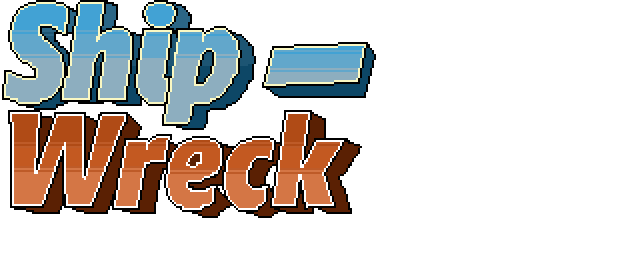

  

# ✈ Ship Wreck
### Jogo feito com C++ 17 e framework [raylib](https://www.raylib.com/)
- Esse jogo foi desenvolvido para o projeto final do curso C++ do SENAI Anchieta - Vila Mariana.
- Foi dado 5-6 dias pra desenvolver do 0 um projeto em C++ !!
- Tivemos a ideia de um jogo do estilo [Shoot 'em up](https://pt.wikipedia.org/wiki/Shoot_%27em_up) mais especificamente [Aero Fighters](https://pt.wikipedia.org/wiki/Aero_Fighters)
- Caso queira testar o jogo, instale o .exe dentro dessa mesma pasta ou compile manualmente com [template raylib pra VSCode](https://gitlab.com/GameDevTV/CPPCourse/raylib-vscode-template/-/tree/main)

---

### 👨‍💻 Desenvolvedores

- [Lucas Costa](https://github.com/Lucasbc47)
- [Skillterer](https://github.com/Skillterer)
- [Vinicius Rampazi](https://github.com/icexsilent)
